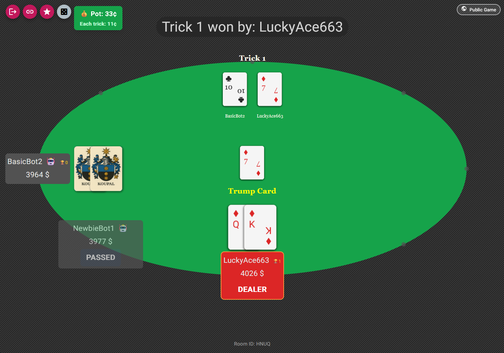

# Swick



Swick is an online multiplayer Swick game. You can play it [here](https://play.swickcardgame.com).

## Architecture
The game's frontend is made with Angular. The backend is made using Node.js and the [Colyseus](https://github.com/colyseus/colyseus) framework.
The frontend is deployed on AWS S3 Pages. The backend is deployed on AWS EC2.

## Folder structure
    .
    ├── src                     # Angular frontend
    ├── cypress                 # Cypress e2e tests
    ├── backend                 # Colyseus backend
    │   ├── src                 # Backend sources
    │   └── ...
    └── ...

## Local development

```
$ npm start                         # starts frontend
$ npm test                          # runs frontend unit tests
$ npm run e2e                       # runs e2e tests
$ npm run deploy                    # deploys frontend to gh-pages
$ npm run backend-start             # starts backend
$ cd backend && npm test            # runs backend unit tests
$ cd backend && npm run deploy      # deploys backend to fly.io               
$ cd backend && npm run loadtest    # runs backend loadtests          
```